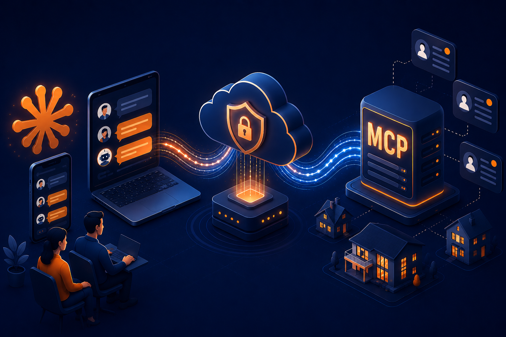
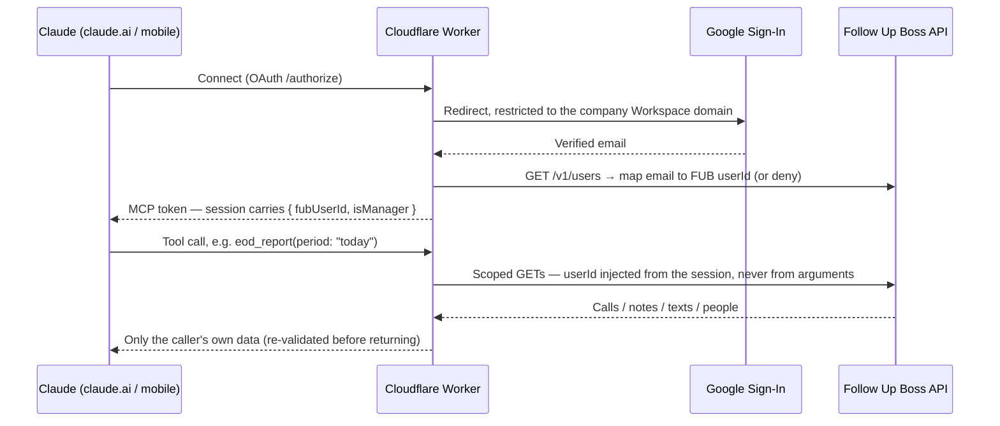

# MCP Connector - Follow Up Boss


<p align="center">
  
</p>

A remote [MCP](https://modelcontextprotocol.io) server on Cloudflare Workers that lets a real-estate sales team talk to their CRM ([Follow Up Boss](https://www.followupboss.com)) from Claude — web and mobile, no install, no API keys in anyone's hands.

A closer asks *"How did I do today?"* and Claude answers from live CRM data: their calls (with the AI call summaries already logged on each call), the notes they wrote, their texts, an exact numeric summary. Two managers get an account-wide view — team leaderboard, per-closer drill-down, live pipeline by stage — from the same connector, gated by role. Everything is **read-only** and every request is **scoped server-side to the signed-in user**.

Built for the same production engagement as [real-estate-crm-automation-suite](https://github.com/Alexey0424/real-estate-crm-automation-suite). This ran (and runs) in production. Client identifiers, staff names, account IDs, and live URLs have been replaced with fictional equivalents so the engineering can be shown publicly; the code, tests, and design docs are the real thing.

## How it works



One Worker plays three roles: an **OAuth server** toward Claude (via [`workers-oauth-provider`](https://github.com/cloudflare/workers-oauth-provider)), an **OAuth client** toward Google for identity, and an **MCP server** (a Durable Object running [`McpAgent`](https://developers.cloudflare.com/agents/)) exposing the tools. The single Follow Up Boss API key lives only as a Worker secret; users never see or handle credentials.

## The security model

The client's hard requirement: a closer must *never* be able to see another closer's data — not by asking nicely, not by crafting arguments. That is enforced by construction, not by prompt:

- **Identity comes from the session, never from tool input.** Every tool reads `fubUserId` from the OAuth session props written at login. No tool accepts a user id (closer tools) — there is nothing to spoof.
- **Scoping is applied server-side and re-validated.** Queries are filtered by the session's userId *and* every returned record is checked again before it leaves the Worker (defense in depth against API quirks).
- **Ownership checks before drill-down.** `get_lead_activity` refuses any lead not assigned to the caller.
- **Role gating by tool registration.** Manager tools are only *registered* on sessions whose verified email is on the `MANAGER_EMAILS` allowlist — for everyone else the tools don't exist, so they can't be called, discovered, or confused into use.
- **Domain-restricted, verified sign-in.** Google Sign-In with `email_verified` + company-domain enforcement server-side (plus the `hd` hint and an Internal consent screen), then a further check that the email maps to an actual FUB user.
- **Read-only by construction.** The connector implements `GET`s only. There is no write tool to misuse.

## Tools

| Everyone (scoped to self) | What it answers |
|---|---|
| `list_my_calls` | "Show me my calls this week" — each with the AI-summary note (score, topics, sentiment) |
| `my_call_summary` | Exact counts: total, answered, no-answer, talk time, distinct leads — aggregated server-side so the numbers aren't model-counted |
| `list_my_notes` | Notes the caller authored, by period |
| `find_my_leads` | Search only the caller's assigned leads |
| `get_lead_activity` | Full timeline (calls, notes, texts) of one owned lead |
| `eod_report` | The end-of-day bundle a closer actually files: my calls + my notes + my texts on the leads I touched |

| Managers only | What it answers |
|---|---|
| `list_team` | Roster with ids, emails, roles |
| `team_activity` | Per-closer leaderboard for a period, plus a no-activity list |
| `closer_activity` | "Show me everything Ethan did today" — resolves names, handles ambiguity |
| `team_pipeline` | Live lead counts, stage × closer, active stages only |
| `find_leads` | Account-wide lead search |
| `lead_activity` | Any lead's full timeline |

## Repository tour

```
src/
  index.ts            OAuthProvider wiring: /mcp API route, /authorize, /token, /register
  google-handler.ts   Google Sign-In round-trip: domain check, FUB user mapping, session props
  mcp.ts              The MCP agent: 6 closer tools + 6 manager tools (registered only if isManager)
  tools-manifest.ts   Single source of truth for which tools exist per role
  fub/                Follow Up Boss API client + per-domain query modules (calls, notes, people, team…)
  lib/                Pure helpers: period math (account TZ), formatting, manager allowlist, classification
test/                 46 unit tests (vitest) — scoping, gating, aggregation, pagination, edge cases
docs/
  design.md                Phase 1 design: requirements, architecture, alternatives considered
  implementation-plan.md   Phase 1 build plan, task-by-task with tests
  manager-view-design.md   Phase 2 design: manager role, gating decision, deferred scope
  manager-view-plan.md     Phase 2 build plan
wrangler.toml         Worker config (vars are examples — see Deploy)
```

Engineering details worth a look:

- **Texts have no global per-agent feed in the FUB API** — the connector reconstructs "my texts" per lead from the leads the closer touched that period, and documents the one edge case that misses (design.md §8).
- **Server-side aggregation for anything numeric.** Claude gets exact totals, not raw rows to count.
- **Period math in the account's timezone**, not the server's — "today" means the sales team's today.
- **Pagination with caps + honesty**: a stage too large to fully page returns partial counts *and says so*.
- **The tool manifest is tested** — the set of registered manager tools must equal the manifest, so role gating can't silently drift.

## Deploy your own

```bash
npm install
npm test

npx wrangler kv namespace create OAUTH_KV      # put the id in wrangler.toml
npx wrangler secret put FUB_API_KEY            # your FUB API key (read access)
npx wrangler secret put GOOGLE_CLIENT_ID       # Google OAuth web client (Internal consent screen)
npx wrangler secret put GOOGLE_CLIENT_SECRET
npx wrangler secret put COOKIE_ENCRYPTION_KEY  # any long random string
npx wrangler deploy
```

Set `ALLOWED_EMAIL_DOMAIN`, `ACCOUNT_TZ`, and `MANAGER_EMAILS` in `wrangler.toml`, add `https://<your-worker>/callback` as the Google client's redirect URI, then add `https://<your-worker>/mcp` as a custom connector in claude.ai (Team: Settings → Organization → Connectors). Each user clicks Connect and signs in with their company Google account — that's the whole onboarding.

## Design docs

The full decision trail is in [`docs/`](docs/): why a remote MCP connector over a local server or a hosted third party, why identity is delegated to Google, what "my data" means precisely, the FUB API capabilities verified live before building, and the phase-2 manager view with its explicitly deferred scope.
